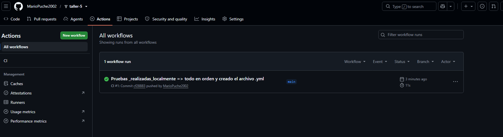
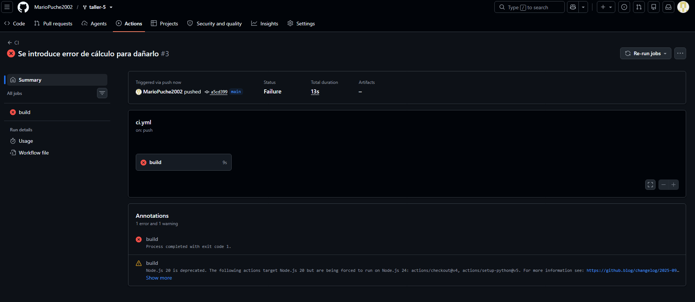
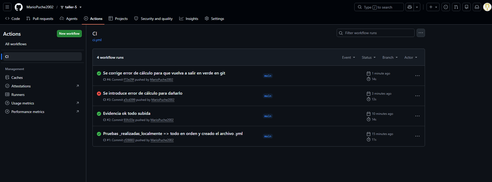
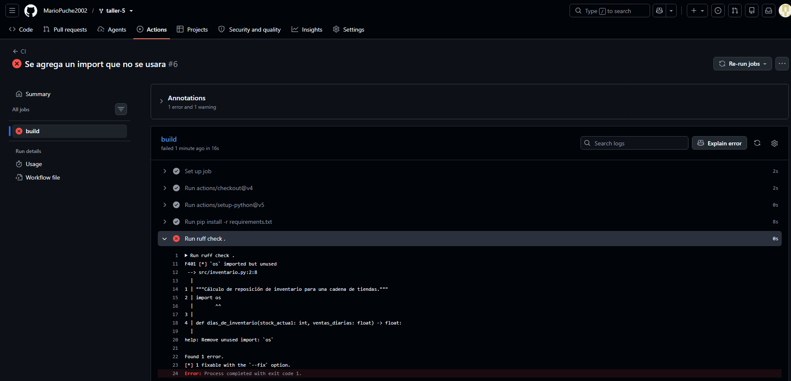

# Taller Semana 5 — El pipeline que nunca se escribió

## Qué hace este proyecto

Este repositorio calcula la reposición de inventario de una cadena de tiendas:
cuántos días dura el stock de cada tienda y cuáles necesitan pedido urgente
(`src/inventario.py`), con sus pruebas correspondientes (`tests/test_inventario.py`).

## Arranque local

```bash
python -m venv .venv
source .venv/bin/activate        # Windows: .venv\Scripts\Activate.ps1
pip install -r requirements.txt
ruff check .                     # All checks passed!
pytest                           # 5 passed
```

## Pipeline de CI

El workflow vive en `.github/workflows/ci.yml` y se dispara automáticamente en
cada `push` y cada `pull_request`. Corre en una máquina `ubuntu-latest` y sigue
estos pasos, en orden:

1. **Checkout** (`actions/checkout@v4`) — trae el código del repo a la máquina virtual, ya que arranca vacía.
2. **Setup Python** (`actions/setup-python@v5`) — instala la versión de Python necesaria.
3. **Instalar dependencias** (`pip install -r requirements.txt`) — instala pytest y ruff.
4. **Lint** (`ruff check .`) — revisa que el código esté limpio (sin imports sin usar, mal formateado, etc.).
5. **Tests** (`pytest`) — corre las 5 pruebas y confirma que la lógica de reposición sigue funcionando.

Si cualquiera de estos pasos falla, el pipeline queda en rojo. Eso evita que un
cambio con errores se integre a `main` sin que nadie lo note.

## Evidencia

### Pipeline en verde (workflow inicial funcionando)



### Rojo por test fallido

Introduje un bug de lógica en `dias_de_inventario` (cambié una división por una
multiplicación), lo que hizo fallar el cálculo de días de stock y, con eso, el test correspondiente:



Luego corregí el bug y el pipeline volvió a verde:



### Rojo por lint fallido

Agregué un `import os` sin usar en `src/inventario.py`. Ruff lo detectó
inmediatamente (regla `F401`) y tumbó el pipeline en el paso de lint, sin
llegar siquiera a correr los tests:



Quité el import sin usar y el pipeline volvió a verde:


## La defensa

**Pregunta:** si un compañero sube un Pull Request con un test que falla,
¿qué pasa exactamente, y por qué eso protege el proyecto?

**Respuesta:** Cuando abro el Pull Request, el pipeline se dispara automáticamente
sobre ese código, y si el test falla, el check queda en rojo antes de que se
pueda hacer el merge.